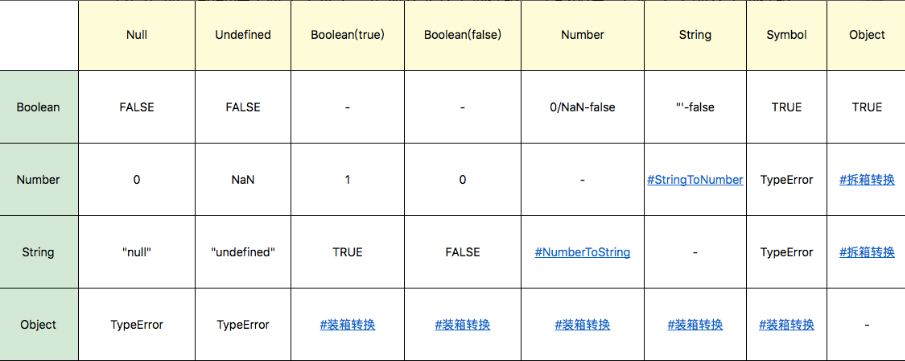
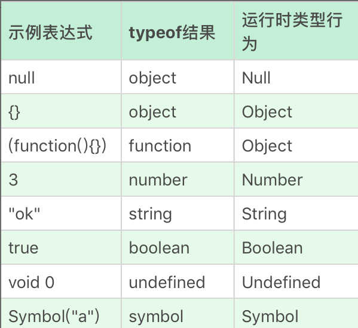

## 抛出问题？

- [ ] 为什么有的编程规范要求用 void 0 代替 undefined？

- [ ] 字符串有最大长度吗？

- [ ] 0.1 + 0.2 不是等于 0.3 么？

- [ ] 为什么 JavaScript 里不是这样的？

- [ ] ES6 新加入的 Symbol 是个什么东西？

- [ ] 为什么给对象添加的方法能用在基本类型上？

为什么有的编程规范要求用 void 0 代替 undefined？

> undefined 是一个变量，不是一个关键字，为了避免无意中被篡改因此使用 void 和 0 来获取undefined 值

字符串有最大长度吗？

> 有的 2^53 - 1
> 
> 该长度是针对 UTF16的编码

Number

有2^64-2^53+3 多个值

NaN

Infinity

\-Infinity

**注意区分+0和-0**： 使用 1/x 来判断是否是 +0或者-0

如何正确比较浮点数的大小

```js
console.log(Math.abs(0.1 + 0.2 - 0.3) <= Number.EPSILON )
```

Symbol

一切非字符串的对象 key 的集合

Symbol 可以具有字符串类型的描述，即使描述相同，Symbol 也不相等。

### 类型转换



```javascript
    var symbolObject = Object(Symbol("a"));

    console.log(typeof symbolObject); //object
    console.log(symbolObject instanceof Symbol); //true
    console.log(symbolObject.constructor == Symbol); //true
```

