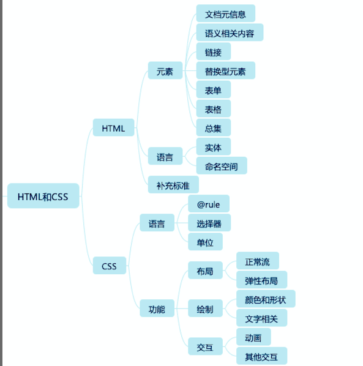
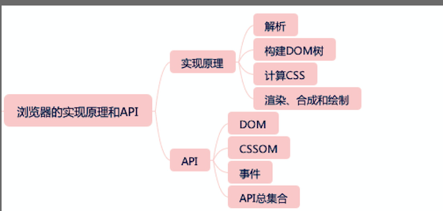
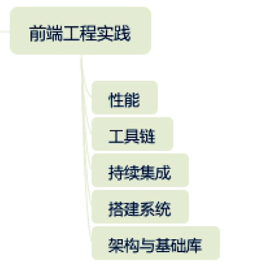

# 重学前端

## 成长

1. 立足标准：系统性总结和整理前端知识，建立自己的认知和方法论

2. 放眼团队：从业务和工程角度思考前端团队的价值和发展需要

## 四大模块

1. js

2. css和html

3. 浏览器实践

4. 前端综合应用

## 学习路径和学习方法

**学习路径：**

1. js高级程序设计

2. 精通css

3. MDN

给js知识：

1. 文法

2. 语义

3. 运行时

> 对于所有的计算机语言来说，都是“用规定的文法，去表达特定的语义，最终操作运行时”的一个过程

程序 = 算法 + 数据结构

那么对于运行时来说，类型就是数据结构，执行过程就是算法

学习方法：

1. 建立知识架构（简单理解为知识的目录，或者索引，把零散的知识组织起来）注意逻辑性和完备性

2. 追本溯源

## js知识架构图

1. 运行时
   
   1. 数据结构
      
      1. 类型
         
         1. 对象
      
      2. 实例
         
         1. 应用和机制
   
   2. 执行过程（算法）

2. 文法
   
   1. 词法
   
   2. 语法

3. 语义

## HTML和css的知识架构

元素：

1. 文档元信息：通常出现在 head 标签中的元素，包含描述文档自身的一些信息

2. 语义相关：扩展了纯文本，表达文章结构、不同语言要素的标签

3. 链接：提供到文档内和文档外的链接

4. 替换型标签：引入声音、图片、视频等外部元素替换自身的一类标签

5. 表单：用于填写和提交信息的一类标签

6. 表格：表头，表尾，单元格等表格的结构

css 部分：

- 语言部分：语法结构，@rule、选择器、单位等等

- 功能：布局、绘制和交互类
  
  - 布局：正常流和弹性布局
  
  - 绘制类：图形相关和文字相关

## 浏览器的实现原理和API

实现原理：解析、构建DOM树、计算css、渲染、合成和绘制的流程图

API：事件、DOM、CSSOM

## 前端工程实践

## 前端总知识框架

在 assets 文件夹下方的 web.webp

